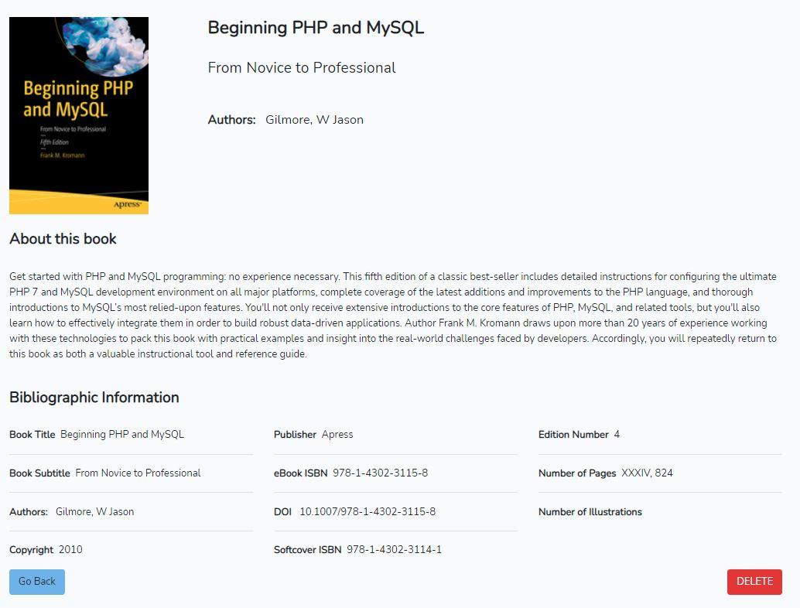

# laravel crud
This is a simple laravel CRUD app.

Create, edit, delete category. 
Insert, edit, delete book

## How to install and run on your local system
1. git clone https://github.com/SergeyHub/books_shop.git
2. cd books_shop/
3. composer install
4. npm install
5. cp .env.example .env
6. php artisan key:generate
7. Add your database config in the .env file 
8. Use book_shop.sql from database
9. php artisan serve (if the server opens up, http://127.0.0.1:8000,  then we are good to go)
10. Navigate to http://127.0.0.1:8000/

